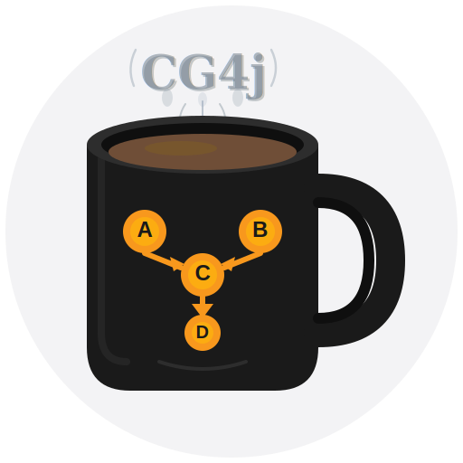

<p align="center">
  
</p>

# CG4j - Call Graph Generation for Java

A command-line tool to build call graphs from Java JAR files using IBM WALA (T.J. Watson Libraries for Analysis).

## Table of Contents

- [Features](#features)
- [Requirements](#requirements)
- [Build](#build)
- [Installation](#installation)
- [Docker](#docker)
- [Usage](#usage)
- [Output Format](#output-format)
- [Testing](#testing)
- [Documentation](#documentation)

## Features

- Builds 0-CFA call graphs using Rapid Type Analysis (RTA)
- Analyzes JAR files and their dependencies
- Generates all public methods as entry points
- Outputs call graph to CSV file
- Clean CLI powered by picocli

## Requirements

- Java 11 or higher
- Maven 3.6 or higher
- Docker (optional, for containerized usage)

## Build

Using Make:
```bash
make build
```

Or using Maven directly:
```bash
mvn clean package
```

This creates `target/cg4j-cli-0.1.0-SNAPSHOT-jar-with-dependencies.jar`

## Installation

### Quick Install

Install cg4j as a system-wide command:

```bash
make install
```

This will:
- Check for Java 11+ and Maven 3.6+
- Build the project with full Maven output
- Install `cg4j` command to `~/.local/bin/`
- Make it available from anywhere in your terminal

**Verify installation:**
```bash
cg4j --help
```

### Uninstall

```bash
make uninstall
```

**Note:** If `cg4j` command is not found after installation, ensure `~/.local/bin` is in your PATH:

```bash
# Add to ~/.bashrc or ~/.zshrc
export PATH="$HOME/.local/bin:$PATH"
```

Then restart your terminal or run `source ~/.bashrc`.

## Docker

### Build and Run

```bash
# Build image
docker build -t cg4j:latest .

# Run analysis
docker run --rm \
  -v $(pwd):/input:ro \
  -v $(pwd):/output \
  cg4j:latest -j /input/myapp.jar -o /output/callgraph.csv
```

### Docker Compose

```bash
# Configure paths (first time only)
cp .env.example .env
# Edit .env to set INPUT_DIR and OUTPUT_DIR

# Run analysis
docker-compose run --rm cg4j -j /input/myapp.jar -o /output/callgraph.csv

# Show help
docker-compose run --rm cg4j --help
```

Default configuration (`.env`):
- Input: `./src/test/resources/test-jars`
- Output: `/tmp/cg4j-output`

## Usage

After installation:
```bash
# Basic usage - outputs to callgraph.csv
cg4j -j myapp.jar

# With dependencies and custom output
cg4j -j myapp.jar -o output.csv -d lib/
```

Or run directly from JAR without installation:
```bash
# Basic usage - outputs to callgraph.csv
java -jar target/cg4j-cli-0.1.0-SNAPSHOT-jar-with-dependencies.jar -j myapp.jar

# With dependencies and custom output
java -jar target/cg4j-cli-0.1.0-SNAPSHOT-jar-with-dependencies.jar -j myapp.jar -o output.csv -d lib/
```

**Options:**
- `-j, --app-jar=<file>` - JAR file to analyze (required)
- `-o, --output=<file>` - Output CSV file (default: callgraph.csv)
- `-d, --deps=<dir>` - Directory containing dependency JAR files
- `-h, --help` - Show help message

## Output Format

CSV file with two columns:
```
source_method,target_method
package/Class.method:(descriptor),package/Class.method:(descriptor)
```

Example:
```
source_method,target_method
<boot>,org/slf4j/Logger.info:(Ljava/lang/String;)V
org/slf4j/Logger.info:(Ljava/lang/String;)V,org/slf4j/helpers/MessageFormatter.format:(Ljava/lang/String;)Ljava/lang/String;
```

## Testing

Using Make:
```bash
make test
```

Or using Maven directly:
```bash
# Run tests
mvn test

# Run tests with coverage report
mvn clean test jacoco:report

# Check coverage percentage
grep -oP '<tfoot>.*?<td class="ctr2">\K[0-9]+%' target/site/jacoco/index.html | head -1
```

Test data: `src/test/resources/test-jars/`

## Documentation

- **New to call graphs?** Read [Call Graph Basics](docs/CALLGRAPH-BASICS.md) to learn about CHA, 0-CFA, and how call graphs are built.
- **System architecture:** See [Architecture](docs/ARCHITECTURE.md) for the internal design and data flow.
